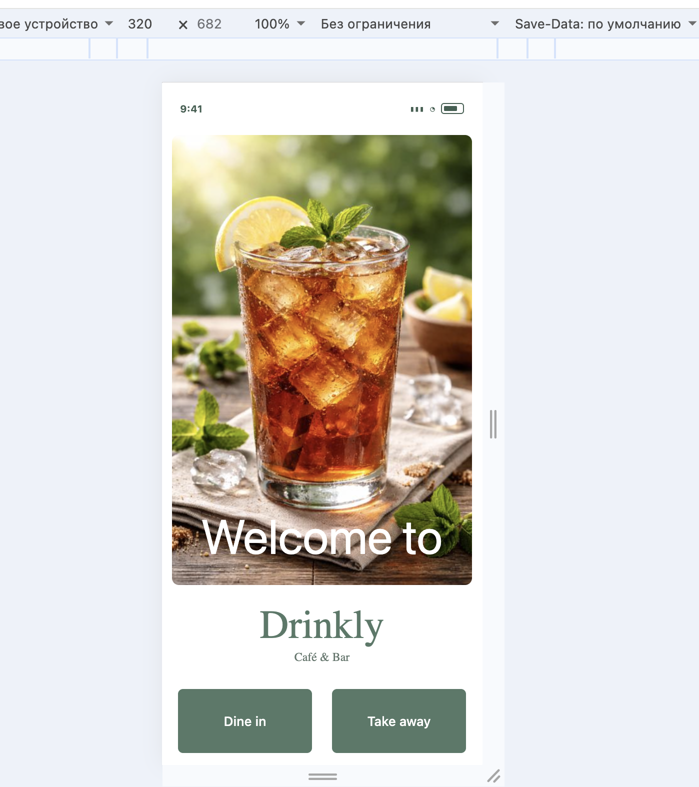
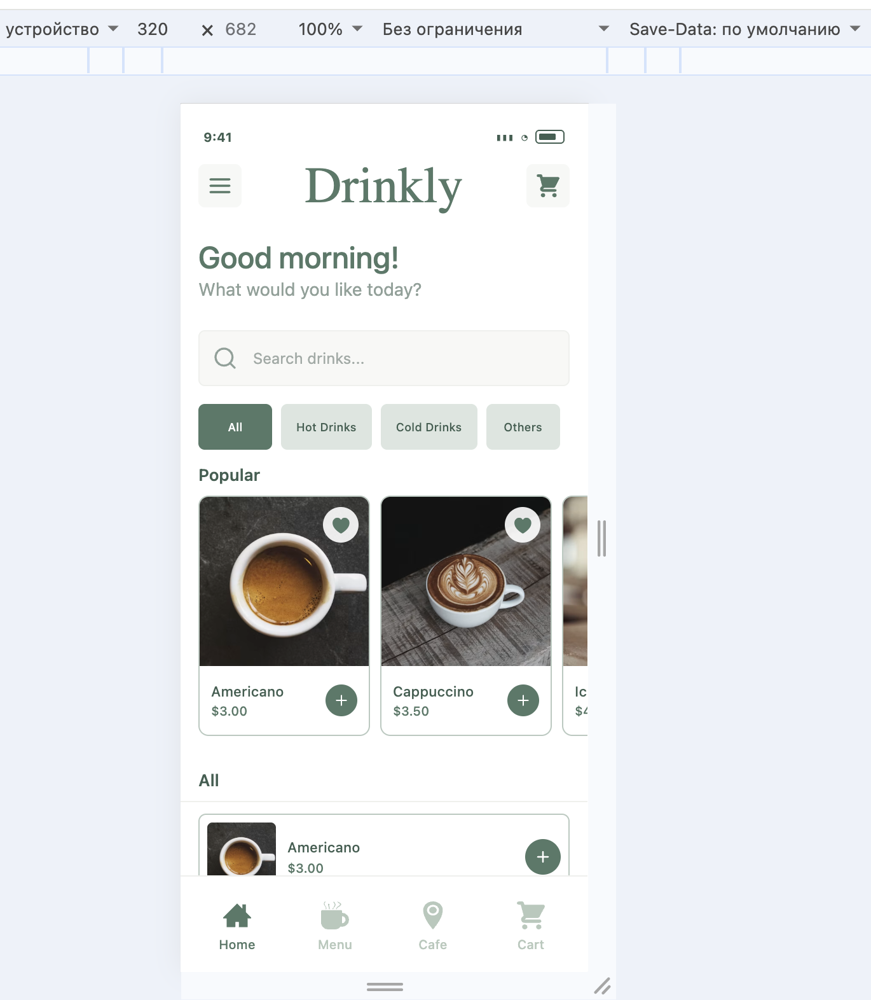
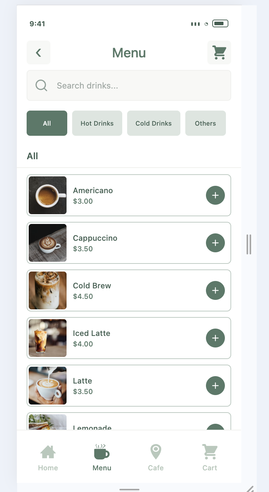
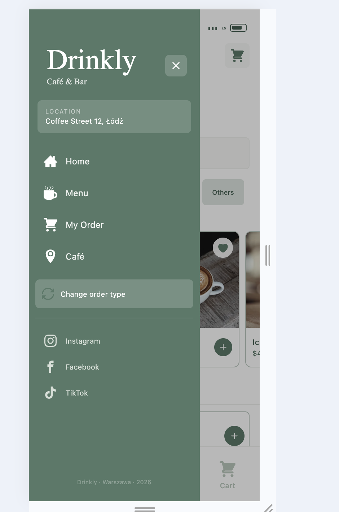
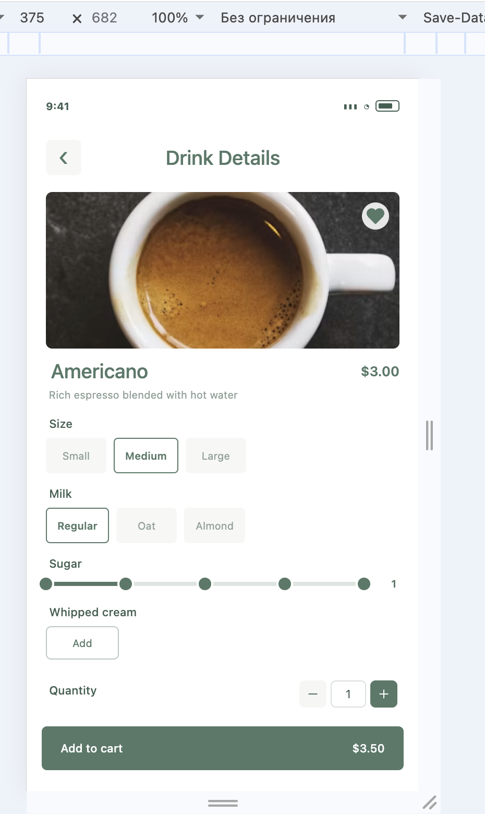
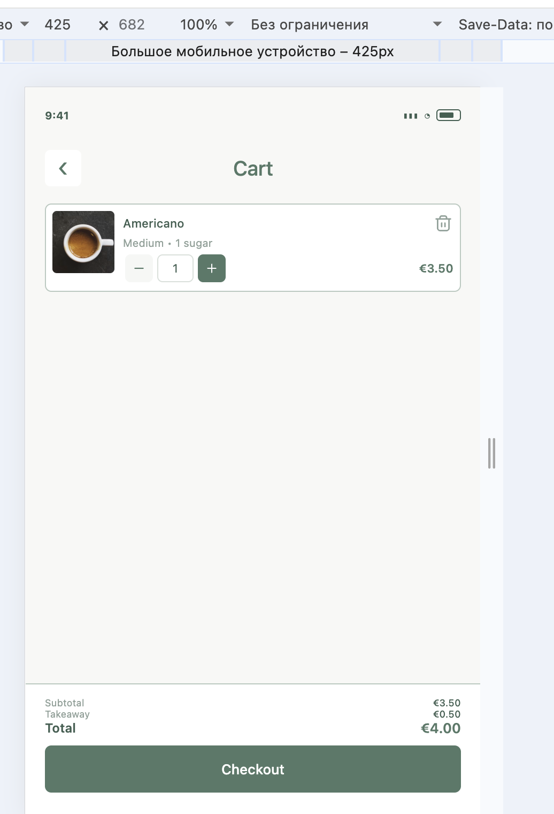
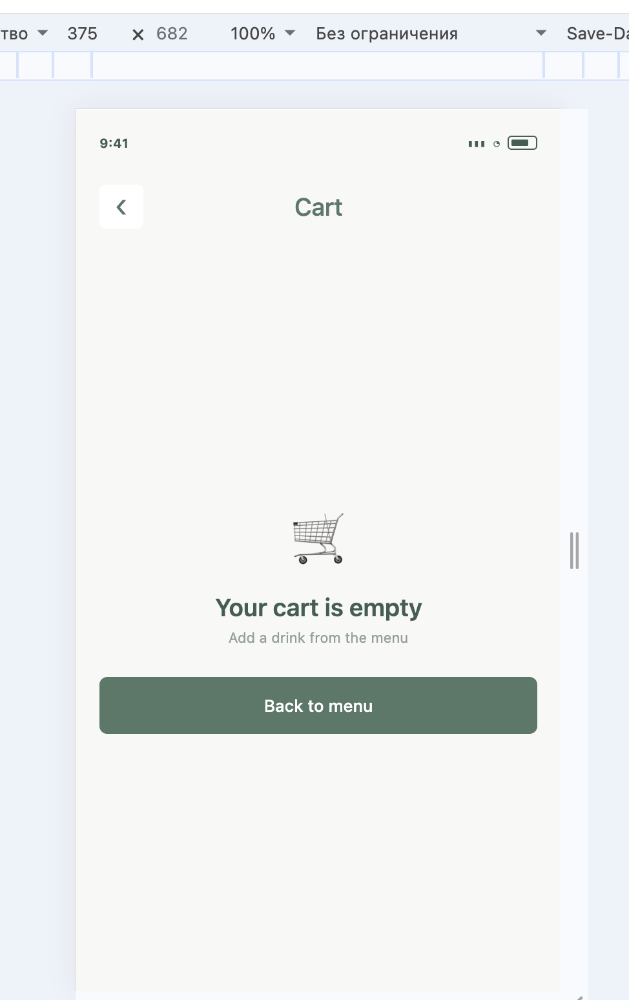
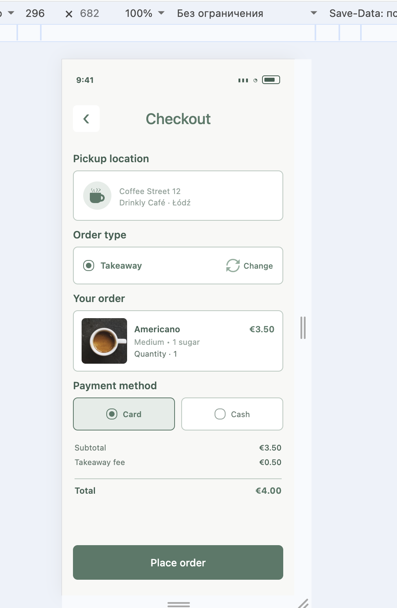
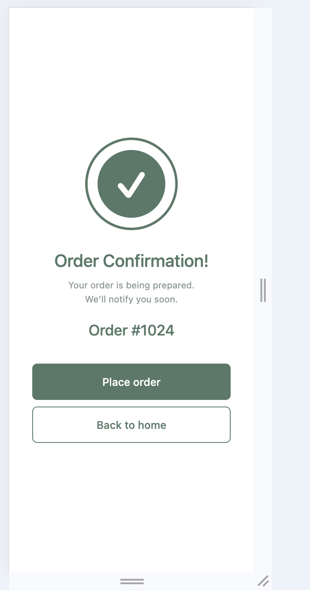

# Drinkly — React Native Drink Ordering App

A mobile-first drink ordering application built with React Native, Expo and TypeScript.

Drinkly allows users to browse drinks, search and filter the catalog, view drink details, customize their order, manage the cart, choose an order type and complete the checkout process.

## 📱 Preview

- Welcome
- Home
- Menu
- Drawer Menu
- Drink Details
- API Coffee Details
- Cart
- Checkout
- Order Confirmation
- Café

## ✨ Features

### Main application features

- Welcome screen
- Dine-in and takeaway order types
- Home screen with popular drinks
- Drink categories
- Search drinks
- Drink details
- Drink customization
- Add drinks to cart
- Quantity controls
- Remove items from cart
- Checkout
- Payment method selection
- Order confirmation
- Café information
- Bottom navigation
- Drawer navigation
- Responsive mobile layout
- Navigation between screens with React Navigation
- Passing drink IDs through navigation parameters
- Validation of invalid or missing drink IDs

### API features

- Integration with a public REST API
- Loading coffee drinks from the API
- Fetch API for HTTP requests
- API data stored in React state
- Loading state
- Error handling
- API coffee cards
- API coffee details screen
- Passing API item IDs through navigation parameters
- Validation when an API coffee item cannot be found
- `FlatList` for rendering API data
- Custom `ApiCoffeeCard` component
- `keyExtractor` for API list items

---

# ☕ API Integration

Drinkly uses a public REST API to load additional coffee drinks.

### Public API

The application uses the following endpoint:

https://api.sampleapis.com/coffee/hot

The API does not require an API key.

The API provides coffee data including:

id
title
description
ingredients
image

The API integration is separated from the UI and stored in:

src/api/coffeeApi.ts
🔌 API Request

API communication is implemented using the native JavaScript fetch API.

The API URL is stored in a constant:

const API_URL = "https://api.sampleapis.com/coffee/hot";

The request is handled by the fetchCoffee function:

export const fetchCoffee = async (): Promise<ApiCoffee[]> => {
const response = await fetch(API_URL);

if (!response.ok) {
throw new Error(`API request failed: ${response.status}`);
}

const data: ApiCoffee[] = await response.json();

return data;
};

The API logic is kept separate from the screen components.

📦 API Data Type

The API response is represented by the ApiCoffee TypeScript interface:

export interface ApiCoffee {
id: number;
title: string;
description: string;
ingredients: string[];
image: string;
}

This provides type safety when working with API data.

🔄 API Data Flow

The API data is loaded on the Home screen using useEffect.

The received data is stored in React state using useState.

The basic data flow is:

Home Screen
↓
fetchCoffee()
↓
Public Coffee API
↓
API response
↓
apiDrinks state
↓
FlatList
↓
ApiCoffeeCard
↓
ApiCoffeeDetails
⏳ Loading State

While the API request is being processed, the application displays:

Loading...

The loading state is controlled with React state:

const [loading, setLoading] = useState(true);

The state is updated when the API request starts and finishes.

⚠️ Error Handling

The API request is wrapped in try/catch.

If the request fails, the application displays:

Unable to load drinks. Please try again.

The error state is stored separately:

const [error, setError] = useState<string | null>(null);

The API error handling was tested by temporarily using an invalid API URL.

📋 API List

API drinks are displayed using React Native FlatList.

The list uses a custom component:

src/components/ApiCoffeeCard.tsx

Each API item has a unique key based on its API ID:

keyExtractor={(item) => item.id.toString()}

The ApiCoffeeCard receives the API drink through props and handles the press event.

☕ API Coffee Details

When the user presses an API coffee card, the application navigates to:

ApiCoffeeDetails

The selected API item ID is passed through navigation parameters:

navigation.navigate("ApiCoffeeDetails", {
itemId,
});

The details screen receives the parameter using React Navigation:

const { itemId } = route.params;

The API data is loaded and the corresponding coffee item is found by its ID.

If the item does not exist, the application displays:

Coffee not found.

The API details screen displays:

coffee image
coffee title
description
ingredients

## 🧭 Navigation

The application uses **React Navigation** with three navigation types:

### Stack Navigator

The root stack controls the main application flow:

- `Welcome`
- `AppDrawer`
- `DrinkDetails`
- `ApiCoffeeDetails`
- `Checkout`
- `Payment`
- `Confirmation`

### Drawer Navigator

The drawer provides access to:

- Home
- Menu
- My Order
- Café
- Change order type
- Social media links

The drawer keeps the original Drinkly visual design through a custom drawer content component.

### Tab Navigator

The main application uses a bottom tab structure:

- Home
- Menu
- Cart

The native tab bar is hidden because the application uses the custom `BottomNavigation` component for the visual interface.

The Café screen is available through the Drawer navigation.

### Navigation parameters

The application uses navigation parameters for different types of data.

Local drink details

Drink details receive a drinkId parameter:

navigation.navigate("DrinkDetails", {
drinkId: drink.id,
});

The `DrinkDetails` screen validates the received ID and displays an error state if the drink does not exist.

API coffee details

API coffee details receive an itemId parameter:

navigation.navigate("ApiCoffeeDetails", {
itemId,
});

The ApiCoffeeDetails screen uses this ID to find the corresponding API item.

Checkout → Confirmation

The selected payment method is passed through navigation parameters:

navigation.navigate(SCREENS.CONFIRMATION, {
paymentMethod: method,
});

The Confirmation screen receives the value through:

const route = useRoute<
RouteProp<RootStackParamList, "Confirmation">

> ();

const paymentMethod = route.params.paymentMethod;

This provides an additional example of passing data between screens using route.params.

Navigation screen names are stored in:

```text
src/constants/screens.ts
```

This provides reusable constants such as:

```tsx
SCREENS.HOME;
SCREENS.MENU;
SCREENS.CART;
SCREENS.DRINK_DETAILS;
SCREENS.CHECKOUT;
SCREENS.CAFE;
```

## 🌐 Global State Management

Assignment 6 demonstrates two approaches to global state management:

- React Context API
- Redux Toolkit

The application uses both approaches for different types of global state.

### Context API

React Context API is used for application-wide theme and shared application state.

The Context implementation is located in:

````text
src/context/
├── AppContext.tsx
└── ThemeContext.tsx

ThemeContext

ThemeContext stores the current application theme:

light
dark

The context provides:

theme
toggleTheme()

The ThemeProvider is connected at the root of the application in App.tsx.

Components use the context through the useTheme() hook.

The theme is demonstrated in several components, including:

Welcome
Header
BottomNavigation

The theme can be changed by pressing the theme button.

The Context API demonstrates how shared state can be accessed by different components without passing it through props.

AppContext

AppContext stores shared application state related to the ordering flow.

It provides:

order mode
payment method
selected drink
favorites

The context also provides actions for changing and resetting this state.

The custom useAppContext() hook is used by components that need access to this shared state.

Redux Toolkit

Redux Toolkit is used to manage the shopping cart.

Redux dependencies:

@reduxjs/toolkit
react-redux

Redux files are located in:

src/store/
├── cartSlice.ts
└── store.ts
Cart Slice

The cart state contains:

items: CartItem[]

The cart slice provides the following reducers:

addItem
removeItem
updateQuantity
clearCart
Redux Store

The Redux store is configured using configureStore().

The store contains the cart reducer:

cart
└── items

The application is wrapped with the Redux Provider in App.tsx.

Redux in Components

The application uses:

useSelector() to read cart data
useDispatch() to update cart data

Redux is integrated into:

Drink Details
Cart
Checkout
Order Confirmation
Bottom Navigation

For example, adding a drink to the cart dispatches the addItem action.

Changing the quantity dispatches updateQuantity.

Removing an item dispatches removeItem.

After successful order confirmation, clearCart removes the completed order from the Redux store.

Why two approaches are used

Context API and Redux Toolkit are demonstrated as two different approaches to global state management.

Context API is used for shared application settings and state such as the theme.

Redux Toolkit is used for the shopping cart because the cart contains multiple related operations such as adding items, removing items and updating quantities.

This separation keeps the application state organized and demonstrates both approaches required by the assignment.

## 🛠️ Technologies

- React Native
- Expo
- TypeScript
- React Navigation
- React Navigation Native Stack
- React Navigation Bottom Tabs
- React Navigation Drawer
- React Hooks
- Fetch API
- FlatList
- React Native StyleSheet
- Flexbox
- React Native Gesture Handler
- React Native Reanimated
- Public REST API

## 🧩 Reusable Components

The application is built using reusable React Native components.

Examples:

- Header
- StatusBar
- Button
- DrinkCard
- ApiCoffeeCard
- MenuCard
- CartItem
- CategoryTabs
- SearchBar
- QuantityControl
- OptionButton
- CheckoutChoice
- SummaryRow
- BottomNavigation
- Icon

Components receive data and callbacks through props, which makes them reusable across different screens.

## 📂 Project Structure

```text
DrinklyExpo/
│
├── App.tsx
│
├── src/
│   │
│   ├── api/
│   │   └── coffeeApi.ts
│   │
│   ├── components/
│   │   ├── ApiCoffeeCard.tsx
│   │   ├── BottomNavigation.tsx
│   │   ├── Button.tsx
│   │   ├── CartItem.tsx
│   │   ├── CategoryTabs.tsx
│   │   ├── CheckoutChoice.tsx
│   │   ├── DrinkCard.tsx
│   │   ├── Header.tsx
│   │   ├── Icon.tsx
│   │   ├── MenuCard.tsx
│   │   ├── OptionButton.tsx
│   │   ├── QuantityControl.tsx
│   │   ├── SearchBar.tsx
│   │   ├── StatusBar.tsx
│   │   └── SummaryRow.tsx
│   │
│   ├── constants/
│   │   ├── colors.ts
│   │   ├── dimensions.ts
│   │   ├── screens.ts
│   │   └── typography.ts
│   │
│   ├── context/
│   │   └── AppContext.tsx
│   │   └── ThemeContext.tsx
│   │
│   ├── data/
│   │   └── drinks.ts
│   │
│   ├── navigation/
│   │   ├── AppNavigator.tsx
│   │   ├── DrawerNavigator.tsx
│   │   ├── StackNavigator.tsx
│   │   ├── TabNavigator.tsx
│   │   └── navigationTypes.ts
│   ├── store/
│   │   ├── cartSlice.ts
│   │   └── store.ts
│   │
│   ├── pages/
│   │   ├── Welcome.tsx
│   │   ├── Home.tsx
│   │   ├── Menu.tsx
│   │   ├── DrinkDetails.tsx
│   │   ├── Cart.tsx
│   │   ├── Checkout.tsx
│   │   ├── PaymentMethod.tsx
│   │   ├── OrderConfirmation.tsx
│   │   └── Cafe.tsx
│   │
│   ├── types/
│   │   └── index.ts
│   │
│   └── utils/
│       ├── options.ts
│       └── price.ts
│
├── screenshots/
│
├── app.json
├── package.json
├── tsconfig.json
└── README.md
````

## 🎨 Styling

The project uses React Native's `StyleSheet.create()` for component styling.

Reusable design values are stored in separate constants:

- colors
- dimensions
- typography

This helps keep the interface consistent and reduces duplicated values and magic numbers.

## 📱 Mobile Responsive Design

Drinkly is designed as a mobile-first application for smartphones.

The main design target is the iPhone 17 screen size. The interface uses responsive React Native components so that the same layout adapts to different smartphone screen widths.

The application was tested at:

| Width  | Purpose             |
| ------ | ------------------- |
| 320 px | Small smartphone    |
| 375 px | Compact smartphone  |
| 390 px | Standard smartphone |
| 430 px | Large smartphone    |

### Responsive techniques

The application uses:

- `useWindowDimensions()`
- Flexbox
- flexible widths
- `aspectRatio`
- responsive card sizes
- `ScrollView`
- adaptive horizontal spacing
- reusable components

The same UI components are used across platforms without creating separate layouts for different screen sizes.

## 🚀 Getting Started

### 1. Clone the repository

```bash
git clone <YOUR_REPOSITORY_URL>
```

### 2. Go to the project directory

```bash
cd DrinklyExpo
```

### 3. Install dependencies

```bash
npm install
```

### 4. Start the development server

```bash
npx expo start
```

To run the web version:

```bash
npx expo start --web
```

## 🔍 TypeScript Check

The project can be checked with:

```bash
npx tsc --noEmit
```

The application is developed with TypeScript to provide type safety for:

- components
- props
- navigation
- navigation parameters
- local drinks
- API drinks
- cart data
- API responses

The final project passes the TypeScript check without errors.

## 📋 Main User Flow

### Welcome



#### Context API — Theme


### Home



### Menu



### Drawer Menu



### Drink Details



### Add to Cart



### Cart



#### Redux Toolkit — Cart


### Checkout



### Order Confirmation



Users can navigate between the main sections using the custom bottom navigation and Drawer navigation.

### ☕ API Flow

The API functionality can be demonstrated through the Home screen.

Home
↓
From API
↓
API Coffee Card
↓
ApiCoffeeDetails
↓
Back to Home

The API section displays coffee drinks loaded from the public Coffee API.

Selecting an API coffee opens its details screen using the corresponding itemId.

## 🔄 Order Flow

The main ordering flow is:

```text
Welcome
   ↓
Home
   ↓
Drink Details
   ↓
Cart
   ↓
Checkout
   ↓
Order Confirmation
   ↓
Home
```

Users can also return to the previous screen using the Back action.

After order confirmation, the cart is cleared and the user can return to the Home screen.

## 📚 Assignment

This project was created as part of a React Native learning assignment.

The project demonstrates:

React Native

- React Native components
- component reusability
- props
- styling
- Flexbox
- responsive design

  TypeScript

- typed components
- typed props
- typed navigation
- navigation parameters
- typed local data
- typed API responses

  Navigation

- Stack navigation
- Tab navigation
- Drawer navigation
- nested navigators
- navigation parameters
- parameter validation
- screen transitions

  API / Data

- public REST API
- Fetch API
- asynchronous data loading
- useEffect
- useState
- FlatList
- custom API card component
- keyExtractor
- loading state
- error handling
- API details screen
- API navigation parameters

🚀 Getting Started

1. Clone the repository
   git clone <YOUR_REPOSITORY_URL>
2. Go to the project directory
   cd DrinklyExpo
3. Install dependencies
   npm install
4. Start the development server
   npx expo start

To run the web version:

npx expo start --web

### 📸 Screenshots

Screenshots demonstrating the application interface and API functionality are stored in:

screenshots/

The API functionality screenshots include:

API drinks displayed on Home
API coffee card
API coffee details
API error state

### 👩‍💻 Author

Наталія Боднарчук
